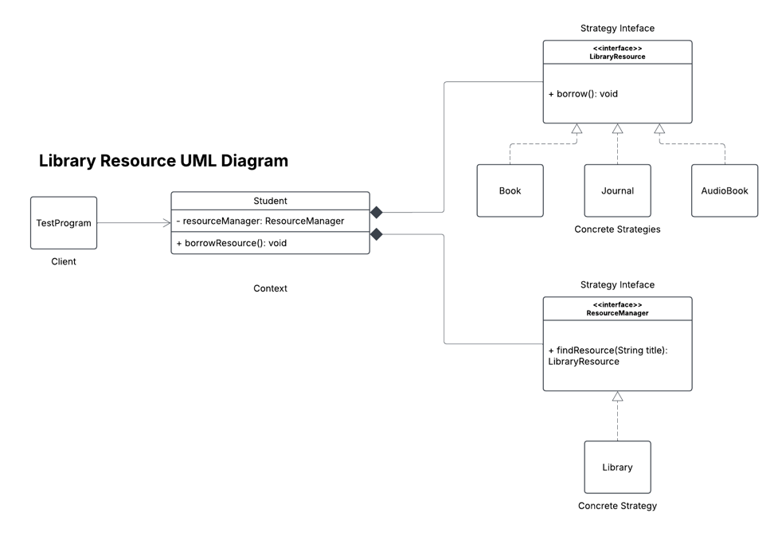

# library-resource
## Problem Statement:
The NEU Library offers a variety of resources, including books, theses, capstones, internet access, journals, and newspapers.

Currently, the **Student** object has methods like **borrowBook()**, **borrowJournal()** with a parameter of title, which directly depend on specific resource types.

To adhere to the **Dependency Inversion Principle (DIP)** and ensure flexibility for future changes (such as introducing audio books or e-journals), we need to refactor the program while maintaining SOLID principles. The goal is to create a robust system that can seamlessly accommodate new resource types in the future.

Your solution should not violate other SOLID principles.

Make sure you have a TestProgram that will validate the proposed refactored codes.

## UML Class Diagram

* Design Pattern Used: **Strategy Pattern**

### SOLID Alignment:
* **S**: Each class has one responsibility (`Book`, `Journal`, `Student`, etc.).
* **O**: Easily add new types (e.g., `EJournal`) without modifying existing code.
* **L**: Substitution works --- `Student` doesn't care what the resource type is.
* **I**: Interfaces are minimal and specific (`LibraryResource`, `ResourceManager`).
* **D**: `Student` depends on `LibraryResource` and `ResourceManager`, not concrete classes.
